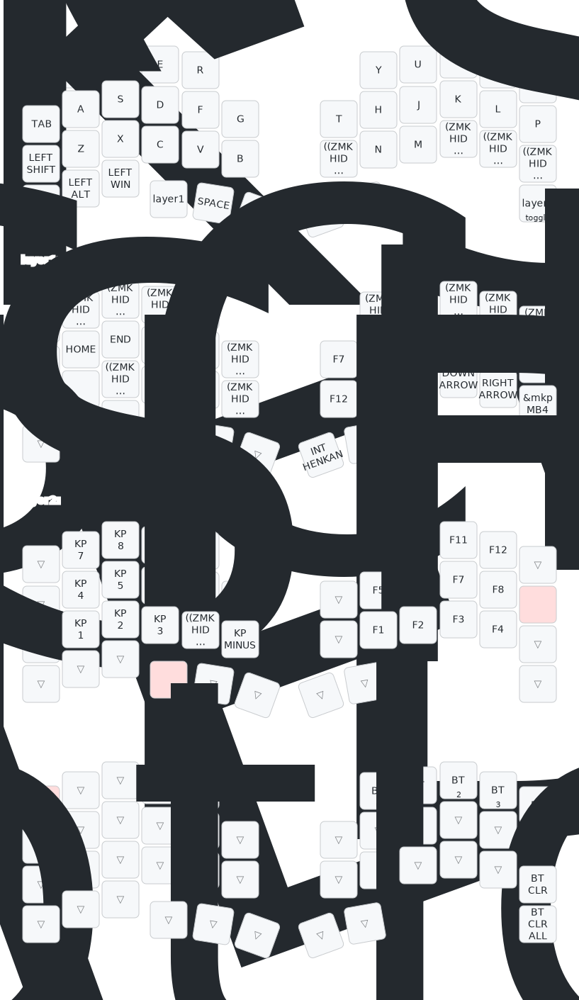

# zmk-config-roBa



## JIS レイアウト対応

キーマップは OS が **JIS キーボード設定** のときに `@` / `#` / `:` / `_` などの記号が期待通り出力されるようになっています。`config/keys_jp.h` に `JP_*` プレフィックス付きキーコードが定義されており、`roBa.keymap` から `#include "keys_jp.h"` で取り込んでいます。

### `keys_jp.h` の再生成手順

[`joelspadin/zmk-locale-generator`](https://github.com/joelspadin/zmk-locale-generator) と [Unicode CLDR](https://github.com/unicode-org/cldr) の日本語キーボード定義から生成しています。ChromeOS 版 XML (`ja-t-k0-chromeos.xml`) が実際の JIS 109 配列 (shift+2=`"`, shift+7=`'`, `^~` キー等) を正しく表現しているためこちらを採用。

Docker で再生成する例:

```bash
mkdir -p /tmp/zmk-locale-work && cd /tmp/zmk-locale-work

# CLDR XML を取得 (CLDR maint-43 ブランチ)
curl -sL "https://raw.githubusercontent.com/unicode-org/cldr/maint/maint-43/keyboards/chromeos/ja-t-k0-chromeos.xml" \
  -o ja-t-k0-chromeos.xml

# Docker で zmk-locale-generator を実行
docker run --rm -v "$(pwd):/work" -w /work python:3.12-slim bash -c "
  apt-get update -qq && apt-get install -qq -y git >/dev/null &&
  pip install --quiet git+https://github.com/joelspadin/zmk-locale-generator.git@1651efd8e685dd81a3da683ef2b8cf5159adc930 &&
  zmk_locale_generator single JP ja-t-k0-chromeos.xml --out keys_jp.h
"

# 生成物を config/ に配置
cp keys_jp.h <このリポジトリ>/config/keys_jp.h
```

| 項目 | 値 |
|---|---|
| CLDR ソース | `keyboards/chromeos/ja-t-k0-chromeos.xml` |
| CLDR ブランチ | [`maint/maint-43`](https://github.com/unicode-org/cldr/tree/maint/maint-43/keyboards/chromeos) |
| generator | [joelspadin/zmk-locale-generator](https://github.com/joelspadin/zmk-locale-generator) |
| generator commit | `1651efd8e685dd81a3da683ef2b8cf5159adc930` (2025-03-09) |
| キーコードプレフィックス | `JP_` |

### 補足

- `¥` は生成ヘッダーに含まれないため、物理 JIS ¥ キー相当の `INT_YEN` (ZMK ネイティブ) を直接使用。
- `|` も生成されない (CLDR では E13 に対して `\` 優先で出力される)。必要になったら `LS(INT_YEN)` で対応可能。
